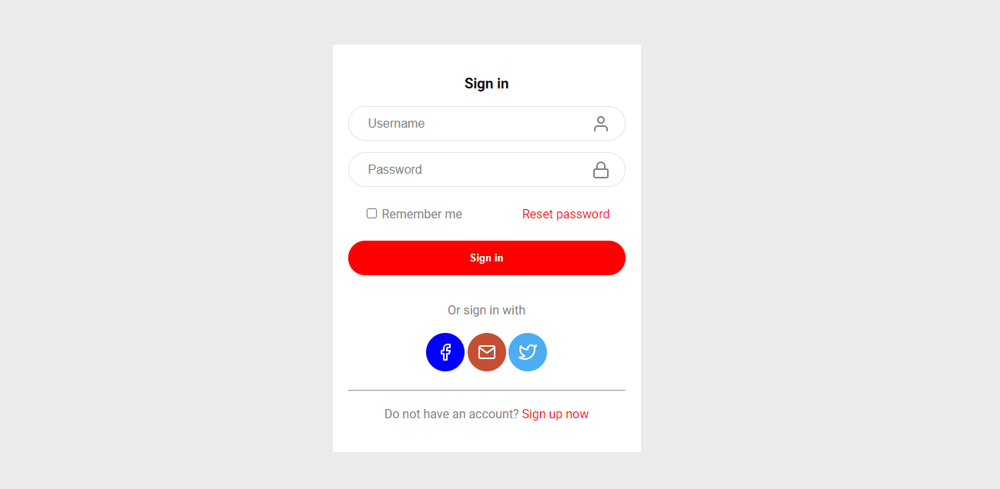

	<h2 align="center">Formulário Login
   
  
  </h2>

<h3  align="center">
		✅ Status: concluído ✅
</h3>

  <a href="https://storyset.com/phone target="_blank">illustrations by Storyset</a>

 

## 📖 Sobre
Projeto realizado durante o curso Frontstart com o objetivo de aprimorar o conhecimento em HTML5 e CSS3 voltados para formulários.

## 🖥️ Demonstração

   

## 🛠 Tecnologias

As seguintes ferramentas foram usadas na construção do projeto:

- [HTML](https://developer.mozilla.org/pt-BR/docs/Web/HTML/Element/form): Tags para formulários como form, label e input (text, password e checkbox).
- [CSS](https://developer.mozilla.org/pt-BR/docs/Learn/Getting_started_with_the_web/CSS_basics):  Posicionar elementos usando display inline block e position absolute.
